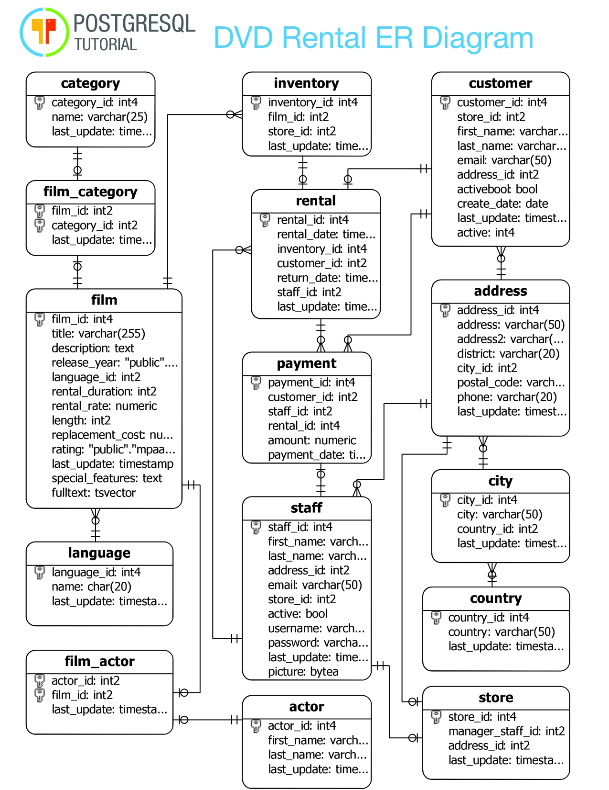

# DVD RENTAL DATABASE QUERY

Hello World, Welcome To The Oasis.

* In this tutorial, we will introduce you to a PostgreSQL sample database that you can use for learning and practicing PostgreSQL.
We will use the DVD rental database to demonstrate the features of PostgreSQL.

* This project is written in PostgreSQL
* To get started, please use the follwing links 
* Download Postgres: https://www.postgresql.org/download/
* Download PG Admin(IDE): https://www.pgadmin.org/download/
* Final Setup: https://www.postgresqltutorial.com/load-postgresql-sample-database/

## Project Scope
### Part 1: SQL FUNDAMENTALS
* This section will be your introdcution to SQL, this will include the use of `SELECT` , `DISTINCT` , `COUNT` , `WHERE` , `LIMIT` , `IN` , `LIKE`,  `ORDER BY` &  `BETWEEN` statements to query our databse.
* This comes with question and answers
* It's advised to tackle the questions first then head towards checkin your queries against the answers.

### Data Dictionary
The database DvdRental has 15 tables. Below are the different tables and a brief description of them.

* actor — contains actors data including first name and last name.
* film — contains films data such as title, release year, length, rating, etc.
* film_actor — contains the relationships between films and actors.
* category — contains film’s categories data.
* film_category — containing the relationships between films and categories.
* store — contains the store data including manager staff and address.
* inventory — stores inventory data.
* rental — stores rental data.
* payment — stores customer’s payments.
* staff — stores staff data.
* customer — stores customer’s data.
* address — stores address data for staff and customers
* city — stores the city names.
* country — stores the country names.

 

### Entity Relationship Diagram

